# Multilingual Synonym Generation & Search Quality Analysis

A multilingual synonym generation and search-quality evaluation system for e-commerce search (Mercari). The pipeline translates queries (e.g. Chinese to Japanese), measures recall via production app searches + BigQuery, and supports human relevancy annotation.

## Table of Contents

- [Pipeline Overview](#pipeline-overview)
- [Repository Structure](#repository-structure)
- [Component Map](#component-map)
- [End-to-End Pipeline](#end-to-end-pipeline)
- [Prerequisites](#prerequisites)
- [Environment Configuration](#environment-configuration)
- [Setup](#setup)
- [Running Each Stage](#running-each-stage)
- [Data Contracts](#data-contracts)
- [Troubleshooting](#troubleshooting)

---

## Pipeline Overview

```mermaid
flowchart LR
    subgraph stage1 [Stage 1: Synonym Generation]
        A["Input CSV\n(original_query_lists/input.csv)"] --> B["main.go\n(Go binary)"]
        B -->|"LiteLLM / Gemini-3-pro"| C["Output CSV\n(synonyms_genrator_output/*.csv)"]
        C --> D["Convertor\n(CSV to JSON)"]
        D --> E["Output JSON\n{input_text, output_synonyms, annotated}"]
    end
    subgraph stage2 [Stage 2: Recall Assessment]
        E --> F["Appium Search\n(test_automation or Annotator)"]
        F -->|"~30 min wait"| G["BigQuery Dump\n(bigQueryDump/bigquery.json)"]
        G --> H["Bigquery package\n(Go)"]
        C --> H
        H --> I["Enhanced JSON\n(bigQueryOutput/*.json)\n{products_matched}"]
    end
    subgraph stage3 [Stage 3: Relevancy Annotation]
        I --> J["annotator_helper_script.py"]
        J -->|"DuckDuckGo + LLM Explainer\n+ Appium live search"| K["Human labels\n(0-3 relevancy)"]
        K --> L["Annotated CSV\n(Annotated_result/search_results.csv)"]
    end
```



**Stage 1 -- Synonym Generation (Go):** An LLM (Gemini 3 Pro via a LiteLLM proxy) translates/generates Japanese search synonyms from input queries (e.g. Chinese). Output is a CSV of `original_query | pipe-delimited synonyms | latency`, then converted to JSON.

**Stage 2 -- Recall Assessment (Appium + BigQuery + Go):** Synonyms are searched in the production Mercari app via Appium automation. After ~30 minutes, search logs become available in BigQuery. The BigQuery dump is downloaded locally and the Go `Bigquery` package cross-references each query/synonym to count matched products, producing an enhanced JSON file.

**Stage 3 -- Relevancy Annotation (Python, human-in-the-loop):** The annotator script loads the enhanced JSON, opens DuckDuckGo for visual context, calls an LLM (GPT-5 Search via LiteLLM) to explain each query in English, drives Appium to search in the live app, and prompts the human annotator for a relevancy score (0-3) plus an optional comment. Results are saved to `Annotated_result/search_results.csv`.

---

## Repository Structure

```
myd/
├── main.go                        # Go entry point: runs stages 1-3 sequentially
├── go.mod                         # Go module definition (nayan/m, go 1.25.5)
├── go.sum                         # Go dependency checksums
├── .gitignore                     # Ignores .env, *.csv, *.json, *.pyc, binaries
├── .gitattributes                 # LF normalization
├── .env.example                   # Environment variable template
│
├── Synonym_genrator/              # Go package: LLM config loading + translation client
│   ├── config.cue                 # CUE schema & profile definition
│   ├── config.go                  # Loads CUE config into LLMProfile struct
│   └── vertex.go                  # LLMClient.Translate() -- calls LiteLLM via openai-go
│
├── scripts/
│   ├── translation_job.go         # Translator: reads input CSV, calls LLM per row, writes output CSV
│   └── run_prod_search.py         # Python entry point: runs Appium recall test suite
│
├── Convertor/
│   └── genrator_csv_to_json.go    # Converts translation CSV to JSON (SynonymEntry schema)
│
├── Bigquery/
│   └── bigquery_matched_product_length_extract.go
│                                  # Loads BigQuery dump, enriches synonyms with products_matched
│
├── LLmHelper/                     # Python package: query explanation for human annotators
│   ├── __init__.py                # Package exports
│   ├── config.cue                 # CUE profile: explain_query_gpt_5_search
│   ├── config.py                  # Loads CUE config by shelling out to `cue export`
│   └── query_explainer.py         # QueryExplainerClient: OpenAI chat completions via LiteLLM
│
├── searchers/
│   └── duckduckgo_search.py       # Selenium Chrome: opens DuckDuckGo text + image tabs
│
├── Annotator/
│   └── annotator_helper_script.py # Human-in-the-loop annotation (Appium + DDG + LLM)
│
└── test_automation/               # Automated Appium recall search (no human input)
    ├── __init__.py
    ├── requirements.txt           # Python dependencies
    ├── search_helpers.py          # SearchLogger, parse_synonyms utilities
    ├── README.md                  # Sub-module documentation
    └── android_test/
        ├── __init__.py
        └── test_mercari_search.py # TestMercariSearch: loads CSV, searches via Appium, logs results
```

---

## Component Map

| Component | Language | Files | Responsibility |
|---|---|---|---|
| **Synonym_genrator** | Go | `config.cue`, `config.go`, `vertex.go` | LLM profile loading from CUE; translation client via LiteLLM/OpenAI Responses API |
| **scripts (Go)** | Go | `translation_job.go` | Reads input CSV, deduplicates, supports resume, calls `LLMClient.Translate` per row, writes output CSV (`original_query,output,latency_ms`) |
| **Convertor** | Go | `genrator_csv_to_json.go` | Parses pipe-delimited output CSV into JSON array of `{input_text, output_synonyms[], annotated}` |
| **Bigquery** | Go | `bigquery_matched_product_length_extract.go` | Loads BigQuery dump JSON, cross-references queries/synonyms, outputs enhanced JSON with `products_matched` map |
| **LLmHelper** | Python | `__init__.py`, `config.cue`, `config.py`, `query_explainer.py` | CUE config loader + `QueryExplainerClient` for GPT-5 Search via LiteLLM proxy |
| **searchers** | Python | `duckduckgo_search.py` | Selenium Chrome helper: opens DuckDuckGo text search + image search in two tabs |
| **Annotator** | Python | `annotator_helper_script.py` | Interactive annotation: loads enriched JSON, opens DDG, explains query via LLM, drives Appium search, prompts human for relevancy (0-3) + comment, saves to `Annotated_result/search_results.csv` |
| **test_automation** | Python | `search_helpers.py`, `android_test/test_mercari_search.py` | Automated Appium search runner for recall measurement (no human input), logs to CSV |
| **scripts (Python)** | Python | `run_prod_search.py` | Entry point wrapper that runs the `test_automation` test suite |

---

## End-to-End Pipeline

### Stage 1: Synonym Generation (Go)

1. `main.go` loads an LLM profile from `Synonym_genrator/config.cue` (profile key: `translator_gemini_3_synonyms_gen_zh_to_jp`).
2. `scripts/translation_job.go` reads `original_query_lists/input.csv`, iterates each unique `original_query`, and calls `LLMClient.Translate()`.
3. `Translate()` (`Synonym_genrator/vertex.go`) sends the query to **Gemini 3 Pro** via the LiteLLM proxy (`https://litellm.mercari.in/v1`) using the OpenAI Responses API. The system prompt instructs the model to return 1-3 canonical Japanese search terms separated by `|`.
4. The translator writes `synonyms_genrator_output/translator_gemini_3_synonyms_gen_zh_to_jp.csv` with columns `original_query,output,latency_ms`. It supports resume -- already-processed rows are skipped on re-run.
5. `Convertor.SaveGenratorOutputToJSONFile()` converts the CSV to `synonyms_genrator_output/translator_gemini_3_synonyms_gen_zh_to_jp.json`.

### Stage 2: Recall Assessment (Appium + BigQuery + Go)

1. Run Appium searches against the production Mercari app for all original queries + synonyms. This can be done via:
   - `test_automation/android_test/test_mercari_search.py` (automated, no human input), or
   - `Annotator/annotator_helper_script.py` (which also drives Appium during annotation).
2. Wait ~30+ minutes for search logs to propagate to BigQuery.
3. Export the BigQuery results and place them at `bigQueryDump/bigquery.json`.
4. `main.go` calls `Bigquery.ProcessCSVWithBigQueryData()` which:
   - Loads the BigQuery dump and the translation CSV.
   - For each original query + synonym, searches `matched_queries_map` entries and counts products.
   - Writes `bigQueryOutput/translator_gemini_3_synonyms_gen_zh_to_jp.json` with an added `products_matched` map.

### Stage 3: Relevancy Annotation (Python, human-in-the-loop)

1. `Annotator/annotator_helper_script.py` loads `bigQueryOutput/translator_gemini_3_synonyms_gen_zh_to_jp.json`.
2. For each unannotated entry:
   - Opens DuckDuckGo in Chrome (text search + image search) via `searchers/duckduckgo_search.py` for visual context.
   - Calls `LLmHelper.QueryExplainerClient.explain_query()` to produce an English explanation of the query using GPT-5 Search via LiteLLM.
   - Drives Appium to search each query/synonym in the live Mercari app.
   - Prompts the human annotator for a relevancy score (0-3) and an optional comment via `input()`.
3. Results are appended to `Annotated_result/search_results.csv`.
4. The source JSON is updated in-place with `"annotated": true` so the entry is skipped on subsequent runs.

---

## Prerequisites

| Dependency | Version | Purpose |
|---|---|---|
| **Go** | 1.25.5+ | Synonym generation, CSV/JSON conversion, BigQuery analysis |
| **Python** | 3.10+ | Annotation tooling, Appium/Selenium automation, LLM helper |
| **CUE CLI** | Latest | Evaluating `.cue` config files (used by both Go and Python) |
| **Node.js** | 18+ | Required for Appium server |
| **Appium** | 2.x | **MUST be installed system-wide via npm** - Android app automation |
| **Android SDK / Emulator** | API 34+ (Android 16 configured in code) | **MUST be running with Mercari app open and SERP (Search) window visible** |
| **Mercari Global App** | Latest | Installed on emulator/device (`com.mercari.global`) |
| **Google Chrome** | Latest | Selenium DuckDuckGo searches |
| **ChromeDriver** | Matching Chrome version | Required by Selenium |
| **Java JDK** | 11+ | Required by Android SDK tools |

---

## Environment Configuration

### Environment Variables

Only one environment variable is required:

| Name | Purpose | Used In | Format | How to Obtain |
|---|---|---|---|---|
| `LITELLM_API_KEY` | API key for the LiteLLM proxy at `https://litellm.mercari.in/v1` | `Synonym_genrator/vertex.go` (Go), `LLmHelper/query_explainer.py` (Python) | String (bearer token) | Request from Mercari LiteLLM admin |

No dotenv library is used. The variable is read directly via `os.Getenv("LITELLM_API_KEY")` in Go and `os.getenv("LITELLM_API_KEY")` in Python.

Copy the template and fill in your key:

```bash
cp .env.example .env
# Edit .env and set your LITELLM_API_KEY
source .env
```

### Non-Environment Configuration

- **CUE config files** define LLM profiles (model name, temperature, max tokens, system prompt):
  - `Synonym_genrator/config.cue` -- profile `translator_gemini_3_synonyms_gen_zh_to_jp` (Gemini 3 Pro, temp 0.2, 1024 tokens)
  - `LLmHelper/config.cue` -- profile `explain_query_gpt_5_search` (GPT-5 Search, temp 0.2, 128 tokens)

- **Hardcoded constants** in `main.go`:
  - `profileKey` = `"translator_gemini_3_synonyms_gen_zh_to_jp"`
  - `inputPath` = `"original_query_lists/input.csv"`
  - `outputDir` = `"synonyms_genrator_output"`
  - `bigQueryJSONPath` = `"bigQueryDump/bigquery.json"`
  - `bigQueryOutputDir` = `"bigQueryOutput"`

- **Appium capabilities** are hardcoded in `Annotator/annotator_helper_script.py` and `test_automation/android_test/test_mercari_search.py` (platformVersion `"16"`, appPackage `"com.mercari.global"`, server `http://127.0.0.1:4723`).

- **No CLI flags** are used. To change behavior, edit the constants or CUE files directly.

---

## Setup

**Complete these steps in order before running the pipeline:**

### 1. Clone the repository

```bash
git clone <repo-url>
cd myd
```

### 2. Set up environment

```bash
cp .env.example .env
# Edit .env and set LITELLM_API_KEY
source .env
```

### 3. Install Go dependencies

```bash
go mod download
```

### 4. Install CUE CLI

```bash
go install cuelang.org/go/cmd/cue@latest
```

### 5. Install Python dependencies

```bash
pip install -r test_automation/requirements.txt
pip install openai selenium
```

### 6. Install Appium system-wide (REQUIRED)

**Appium must be installed globally on your system** for both recall searches and annotation:

```bash
npm install -g appium
appium driver install uiautomator2
```

Verify installation:

```bash
appium --version  # Should show 2.x
```

### 7. Set up Android emulator (CRITICAL)

**IMPORTANT:** The Android emulator must be running with the Mercari app open and the SERP (Search Results Page) window visible before running any pipeline stage that involves searches.

1. Install Android SDK and create an emulator (API 34+ / Android 16).
2. Install the Mercari Global app (`com.mercari.global`) on the emulator.
3. **Start the emulator and launch the Mercari app.**
4. **Open the search interface (SERP window) in the Mercari app** - this ensures the automation can immediately interact with the search functionality.
5. Verify the emulator is visible:

```bash
adb devices  # Should show your emulator as 'device'
```

6. **Keep the emulator running** throughout the entire pipeline execution.

### 8. Prepare input data

Create the input CSV with one query per row:

```bash
mkdir -p original_query_lists
```

Create `original_query_lists/input.csv`:

```csv
original_query
貂皮大衣
iPhone 充電器
我的英雄學院
```

---

## Running Each Stage

### Stage 1: Synonym Generation + Conversion + BigQuery Enrichment

`main.go` runs all three Go stages sequentially:

```bash
export LITELLM_API_KEY="your-key-here"
go run main.go
```

This will:
1. Read `original_query_lists/input.csv`
2. Call Gemini 3 Pro via LiteLLM for each query
3. Write `synonyms_genrator_output/translator_gemini_3_synonyms_gen_zh_to_jp.csv`
4. Convert the CSV to `synonyms_genrator_output/translator_gemini_3_synonyms_gen_zh_to_jp.json`
5. If `bigQueryDump/bigquery.json` exists, enrich with product match counts and write to `bigQueryOutput/translator_gemini_3_synonyms_gen_zh_to_jp.json`

> **Note:** Step 5 requires a BigQuery dump to exist. On the first run, you may need to comment out the BigQuery processing in `main.go` or provide an empty JSON array file.

### Stage 2a: Automated Recall Search (Appium)

**Prerequisites:**
- Android emulator is running
- Mercari app is open with SERP (Search) window visible
- Appium server is running

Start the Appium server, then run the automated search test:

```bash
# Terminal 1: Start Appium
appium

# Terminal 2: Run searches
python scripts/run_prod_search.py
```

This searches all original queries + synonyms in the Mercari app and logs results to `search_results/search_log.csv`.

### Stage 2b: BigQuery Dump + Enrichment

**⏰ IMPORTANT WAIT TIME:** After completing the Appium searches, you **MUST wait approximately 30 minutes** for the search log data to propagate and become available in BigQuery.

1. **Wait ~30 minutes** after Appium searches complete (this is the minimum time required for search logs to appear in BigQuery).
2. Export search logs from BigQuery using your preferred method (BigQuery console, `bq` CLI, etc.).
3. **Save the exported JSON to `bigQueryDump/bigquery.json`** (create the `bigQueryDump` directory if it doesn't exist).
4. Re-run `main.go` (it will skip already-translated rows and proceed to BigQuery enrichment):

```bash
go run main.go
```

Output: `bigQueryOutput/translator_gemini_3_synonyms_gen_zh_to_jp.json`

### Stage 3: Human Relevancy Annotation

**Prerequisites:**
- Android emulator is running
- Mercari app is open with SERP (Search) window visible
- Appium server is running
- BigQuery enriched data is available in `bigQueryOutput/`

Start Appium, then run the annotation script:

```bash
# Terminal 1: Start Appium
appium

# Terminal 2: Run annotator
export LITELLM_API_KEY="your-key-here"
python Annotator/annotator_helper_script.py
```

For each unannotated entry, the script will:
1. Open DuckDuckGo in Chrome (text + images) for visual context
2. Print an LLM-generated English explanation of the query
3. Search each synonym in the Mercari app via Appium
4. Prompt you: `Enter relevancy score 0-3:` and `Enter comment (if any):`

Results are saved to `Annotated_result/search_results.csv` and the source JSON is marked as annotated.

---

## Data Contracts

### 1. Input CSV (`original_query_lists/input.csv`)

Single column with a header row.

```csv
original_query
貂皮大衣
iPhone 充電器
我的英雄學院
```

### 2. Translation Output CSV (`synonyms_genrator_output/*.csv`)

```csv
original_query,output,latency_ms
貂皮大衣,ミンクコート|毛皮コート,1523
iPhone 充電器,iPhone 充電器|iPhone チャージャー,982
我的英雄學院,僕のヒーローアカデミア|ヒロアカ,1104
```

- `output` contains 1-3 synonyms separated by `|`
- `latency_ms` is the LLM response time in milliseconds

### 3. Synonym JSON (`synonyms_genrator_output/*.json`)

```json
[
  {
    "input_text": "貂皮大衣",
    "output_synonyms": ["ミンクコート", "毛皮コート"],
    "annotated": false
  },
  {
    "input_text": "我的英雄學院",
    "output_synonyms": ["僕のヒーローアカデミア", "ヒロアカ"],
    "annotated": false
  }
]
```

### 4. BigQuery Dump JSON (`bigQueryDump/bigquery.json`)

```json
[
  {
    "original_query": "僕のヒーローアカデミア",
    "matched_queries_map": [
      {
        "key": "name_ngram_match_phrase_僕のヒーローアカデミア",
        "value": {
          "products": [
            { "product_id": "m12345", "score": "0.95" },
            { "product_id": "m67890", "score": "0.87" }
          ]
        }
      }
    ],
    "query_language_code": "ja",
    "user_id": "user123"
  }
]
```

### 5. Enhanced JSON (`bigQueryOutput/*.json`)

```json
[
  {
    "input_text": "我的英雄學院",
    "output_synonyms": ["僕のヒーローアカデミア", "ヒロアカ"],
    "products_matched": {
      "我的英雄學院": 0,
      "僕のヒーローアカデミア": 119,
      "ヒロアカ": 106
    },
    "annotated": false
  }
]
```

### 6. Annotated Result CSV (`Annotated_result/search_results.csv`)

```csv
input_col,synonyms_col,relevancy,length,comment
我的英雄學院,我的英雄學院,1,0,Original query in Chinese - few results
我的英雄學院,僕のヒーローアカデミア,3,119,Perfect match - official Japanese title
我的英雄學院,ヒロアカ,2,106,Common abbreviation - good but less specific
```

- `relevancy`: 0-3 score assigned by the human annotator
- `length`: product match count from BigQuery data

---

## Troubleshooting

### Appium Connection Failures

- Verify Appium server is running: `appium`
- Check device/emulator is connected: `adb devices`
- Ensure the Mercari app is installed: `adb shell pm list packages | grep mercari`
- If `newCommandTimeout` expires, increase the value in the capabilities dict
- Verify `platformVersion` in the capabilities matches your emulator's Android version

### Selenium / ChromeDriver Issues

- ChromeDriver version must match your installed Chrome version
- Download the correct version from https://chromedriver.chromium.org/downloads
- If Chrome opens but pages don't load, check your network connection
- The DuckDuckGo helper expects Chrome to be installed at the default system path

### BigQuery Auth / Permissions

- The BigQuery dump is expected as a pre-exported JSON file at `bigQueryDump/bigquery.json`
- There is no BigQuery client in this repo; the dump must be obtained externally (e.g. via `bq` CLI or BigQuery console)
- Ensure the dump follows the expected schema (see [Data Contracts](#4-bigquery-dump-json-bigquerydumpbigqueryjson))

### Missing Environment Variables

- If you see `failed to generate content` errors from the Go binary, check that `LITELLM_API_KEY` is set: `echo $LITELLM_API_KEY`
- If the Python annotator fails with OpenAI auth errors, verify the same variable is exported in your shell
- No `.env` file is auto-loaded; you must `source .env` or `export` the variable manually

### CUE CLI Not Found

- The Python `LLmHelper/config.py` shells out to `cue export`. Install CUE: `go install cuelang.org/go/cmd/cue@latest`
- Ensure `$GOPATH/bin` (or `$HOME/go/bin`) is in your `PATH`
